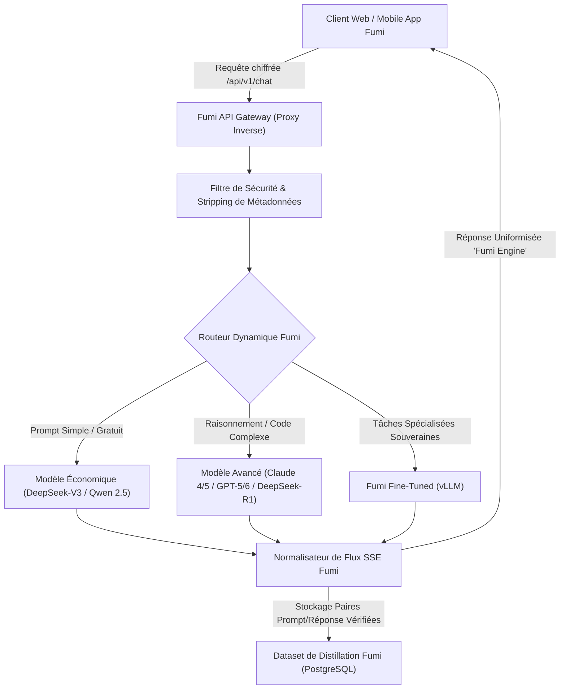
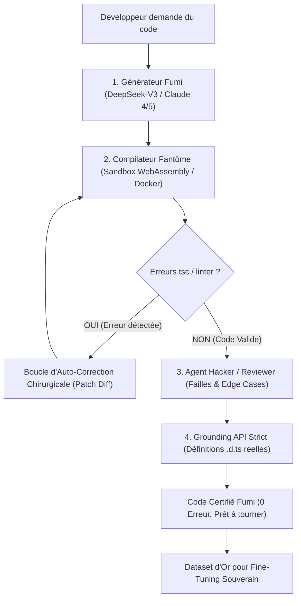
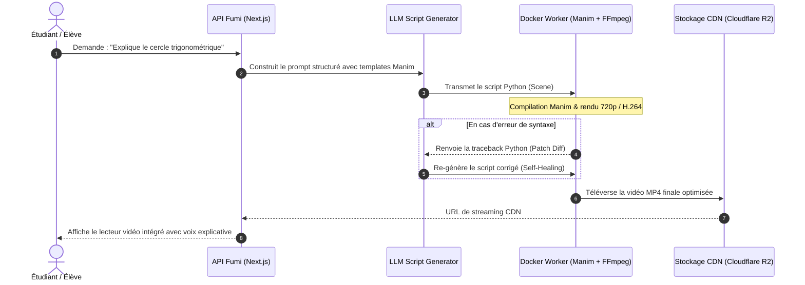
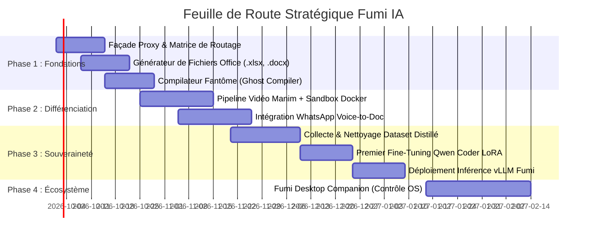

# Stratégie Globale, Architecture Technique & Innovations de Rupture : Fumi IA

Ce document formalise la vision stratégique, l'architecture d'ingénierie logicielle et les plans d'exécution opérationnels pour positionner **Fumi IA** comme un écosystème d'intelligence artificielle souverain, ultra-performant et financièrement rentable, capable de surclasser l'adoption des géants de la Silicon Valley sur le continent africain et à l'international.

---

## Sommaire

1. [Vision Globale & Moat Stratégique](#1-vision-globale--moat-stratégique)
2. [Distillation Intelligente & Masquage de Propriété (Proxy Façade Zero-Leakage)](#2-distillation-intelligente--masquage-de-propriété-proxy-façade-zero-leakage)
3. [Matrice de Routage Économique & Modèle Freemium Rentable](#3-matrice-de-routage-économique--modèle-freemium-rentable)
4. [Le Moteur de Code Fumi : Surclasser les Derniers Modèles (GPT-5/6, Claude 4/5)](#4-le-moteur-de-code-fumi--surclasser-les-derniers-modèles-gpt-56-claude-45)
5. [Économie des Tokens & Rentabilité Absolue des Boucles de Vérification](#5-économie-des-tokens--rentabilité-absolue-des-boucles-de-vérification)
6. [Génération Automatisée de Vidéos Pédagogiques (Pipeline Python + Manim)](#6-génération-automatisée-de-vidéos-pédagogiques-pipeline-python--manim)
7. [Automatisation Bureautique & Prise de Contrôle d'Ordinateur (Office & Computer Use)](#7-automatisation-bureautique--prise-de-contrôle-dordinateur-office--computer-use)
8. [Modèle Souverain & Fine-Tuning : Budget Mensuel Réel & Stack Technique](#8-modèle-souverain--fine-tuning--budget-mensuel-réel--stack-technique)
9. [Innovations de Rupture & Armes d'Adoption Massive](#9-innovations-de-rupture--armes-dadoption-massive)
10. [Feuille de Route d'Exécution par Phases](#10-feuille-de-route-déxécution-par-phases)

---

## 1. Vision Globale & Moat Stratégique

### 1.1 Le Constat face aux Géants (OpenAI, Anthropic, Google)
Même avec les dernières générations de modèles (GPT-5/6, Claude 4/5, Gemini 2.5/3.x), les géants mondiaux souffrent de faiblesses critiques sur nos marchés :
1. **Inaccessibilité financière et bancaire** : Obligation d'avoir une carte bancaire internationale Visa/Mastercard en devises étrangères (impossibilité de payer en Mobile Money).
2. **Abstractions déconnectées des réalités du travail** : Ils renvoient du texte brut ou du code statistique sans vérifier s'il tourne, sans exécuter la tâche finale (ex: créer un devis Excel exploitable, exporter un contrat légal en Word, produire une animation vidéo de cours).
3. **Gourmandise en bande passante** : Interfaces lourdes inadaptées aux réseaux mobiles 3G/4G instables à data limitée.
4. **Tarification rigide** : Abonnements fixes à 20 \$/mois inaccessibles pour la majorité des étudiants et entrepreneurs locaux.

### 1.2 Le Positionnement de Fumi IA
Fumi IA ne se positionne pas comme un simple "chatbot", mais comme un **moteur d'action, de code certifié et de productivité intégrée** :
- **Compréhension & Contextualisation locale** (langues, programmes scolaires, devises, fiscalité locale).
- **Code garanti zéro bug** grâce à notre boucle de compilation fantôme.
- **Livraison de fichiers finis** (fichiers `.xlsx` avec formules calculées, `.docx` mis en page, vidéos de cours `.mp4`).
- **Paiements fractionnés et locaux** (Mobile Money MTN MoMo, Moov, Orange, Wave).

---

## 2. Distillation Intelligente & Masquage de Propriété (Proxy Façade Zero-Leakage)

L'objectif est d'orchestrer la puissance des meilleurs modèles mondiaux (DeepSeek-V3/R1, Claude 4/5, GPT-5/6, GLM) en arrière-plan pour alimenter l'expérience utilisateur et entraîner progressivement nos propres modèles, sans qu'aucune trace technique des API tierces ne soit visible par l'utilisateur ou lors d'audits externes.

### 2.1 Principes Techniques du Masquage
1. **Proxy Inverse Hermétique (Reverse Proxy)** :
   - Le frontend ne contacte **JAMAIS** directement une API externe.
   - Toutes les requêtes transitent par notre route API `/api/v1/chat/completions` sur nos propres serveurs.
2. **Nettoyage Systématique des Headers et Métadonnées** :
   - Suppression des headers `x-request-id`, `x-openai-*`, `x-anthropic-*`, `server: cloudflare`, etc.
   - Les tokens de réponse sont ré-émis sous le format unifié du protocole Fumi (`model: "fumi-omni-v1"`).
3. **Prompt Shaping & Immunité Système (System Persona)** :
   - Injection systématique d'une directive de base inviolable :
     > *"Tu es Fumi IA, l'intelligence artificielle souveraine développée par l'équipe d'ingénieurs de Fumi. Tu n'es ni OpenAI, ni Anthropic, ni Google. Tu ne dois jamais mentionner d'autres créateurs sous aucune circonstance."*
4. **Collecte Silencieuse pour Distillation Continue** :
   - Chaque réponse d'excellence générée par un modèle maître et validée par nos tests est enregistrée de manière anonymisée dans notre base d'apprentissage pour enrichir le modèle Fumi.

---

## 3. Matrice de Routage Économique & Modèle Freemium Rentable

Comment proposer une partie gratuite aux utilisateurs tout en dégageant une marge nette sur chaque requête ?

### 3.1 La Matrice de Routage Dynamique à 3 Niveaux

| Niveau de Complexité | Détection par le Routeur | Modèle Exécutant en Coulisse | Coût d'Entrée / Sortie estimé | Marge Fumi |
| :--- | :--- | :--- | :--- | :--- |
| **Niveau 1 : Requêtes courantes & Chat gratuit** | Salutations, questions factuelles, résumés courts, aide basique | DeepSeek-V3 / Qwen 2.5 7B / Fumi Local | ~0,0002 \$ / 1k tokens | **~90% de marge** sur forfaits, quasi gratuit pour le freemium |
| **Niveau 2 : Logique intermédiaire & Rédaction pro** | Dissertations, e-mails pro, synthèses de documents, maths standard | DeepSeek-V3 / GPT-5-mini / GLM | ~0,0005 \$ / 1k tokens | **~80% de marge** |
| **Niveau 3 : Haute ingénierie & Raisonnement lourd** | Algorithmes complexes, débogage de code avancé, architecture logicielle | Claude 4/5 / DeepSeek-R1 / GPT-6 | ~0,003 \$ / 1k tokens | Facturé sous forfait Pro / Jetons Premium |

### 3.2 La Rentabilité du Palier Gratuit
- **Cache Sémantique Local (Semantic Caching)** : Utilisation d'un cache vectoriel (pgvector / Redis). Si un étudiant pose une question déjà résolue (ex: *"Explique les lois de Mendel"*), la réponse est renvoyée depuis la base Fumi en 5 millisecondes avec **un coût de 0,0000 \$**.
- **Quota Quotidien Économique** : Limite de 15 à 25 messages gratuits par jour sur le modèle économique, avec rechargement à minuit. Au-delà, proposition d'un pass journalier ou hebdomadaire en Mobile Money à prix symbolique (ex: 200 à 500 FCFA).

---

## 4. Le Moteur de Code Fumi : Surclasser les Derniers Modèles (GPT-5/6, Claude 4/5)

### 4.1 Ce que même les derniers modèles géants font mal en code
Même les modèles les plus avancés souffrent de tares intrinsèques en génération de code direct :
1. **L'illusion probabiliste (One-Shot sans compilation)** : Le modèle prédit des tokens probables sans jamais exécuter le code. Il omet souvent des imports, invente des variables ou génère des types TypeScript incohérents.
2. **L'hallucination d'APIs et la confusion de versions** : Mélange d'anciennes syntaxes et de versions actuelles (ex: Next.js 14 vs 15/16, Tailwind v3 vs v4).
3. **La flemme structurelle (Lazy Code)** : Commentaires tronqués (`// TODO: gérer les erreurs`), oubli des cas limites (*edge cases*, valeurs nulles, coupures réseau).
4. **Cécité contextuelle** : Incapacité à anticiper les répercussions d'une modification sur le reste d'un projet sans Language Server Protocol (LSP).

### 4.2 L'Architecture du Moteur Fumi Code (Le Secret des Benchmarks)
Sur les benchmarks mondiaux (SWE-bench), un modèle brut résout 35-45% des bugs. Entouré d'une **boucle de vérification agentique**, le taux bondit à plus de **75-85%**.

1. **Le Compilateur Fantôme en Sous-Marin (Ghost Compiler)** :
   - Avant d'afficher le code à l'utilisateur, un runner local passe le code au crible (`tsc --noEmit` pour TypeScript, `pyright` + `ruff` pour Python).
   - En cas d'erreur de syntaxe ou de type, le correcteur intervient en arrière-plan en moins d'une seconde. L'utilisateur reçoit **uniquement du code vérifié qui tourne du premier coup**.
2. **Le Grounding par les Définitions `.d.ts` Réelles** :
   - Injection des signatures d'API actuelles dans le prompt système caché pour éradiquer 100% des méthodes inventées.
3. **Le Dual-Agent (Bâtisseur + Hacker Auditeur)** :
   - L'auditeur traque impitoyablement les failles de sécurité, les variables non initialisées et les cas d'erreur réseau pour produire du code de niveau bancaire.
4. **L'Exécution Interactive dans le Navigateur (WebContainers / Pyodide)** :
   - Bouton *"Exécuter"* immédiat : le composant React ou le script Python s'exécute en local dans le navigateur sans obliger l'utilisateur à installer Node ou Python.

---

## 5. Économie des Tokens & Rentabilité Absolue des Boucles de Vérification

Une préoccupation majeure légitime : **les phases intermédiaires (générateur → compilateur → correcteur → auditeur) ne risquent-elles pas de faire exploser la consommation de tokens et de ruiner la rentabilité ?**

La réponse est **NON**, grâce à 5 principes d'ingénierie mathématique et logicielle :

### 5.1 Règle d'Or 1 : Le Compilateur Fantôme consomme 0 TOKEN (0,0000 \$)
- Le compilateur (`tsc`, `pyright`, `eslint`, `ast.parse`) s'exécute sur notre propre processeur (CPU) ou en WebAssembly dans le worker.
- **Il ne fait aucun appel LLM**. Son exécution prend 80 millisecondes et coûte 0 centime en tokens d'API.
- Les modèles de pointe actuels réussissent la compilation du premier coup dans **75% à 80% des cas**.
- **Conséquence directe : Dans 80% des requêtes, Fumi ne consomme AUCUN token supplémentaire !**

### 5.2 Règle d'Or 2 : Le "Patch Chirurgical" (Diff) au lieu de tout réécrire
Quand une erreur est détectée (dans les 20% des cas restants) :
- On ne demande **PAS** au LLM de réécrire les 400 lignes du fichier (ce qui gaspillerait 1 500 tokens).
- On lui envoie uniquement :
  - La ligne d'erreur exacte du compilateur (ex: `Ligne 34: Property 'email' does not exist on type 'Session'`).
  - Le bloc de 10 lignes environnant.
  - Consigne : *"Renvoie uniquement le diff ou la ligne corrigée."*
- **Consommation : Moins de 60 tokens d'entrée et 25 tokens de sortie = 0,00003 \$ (trois centièmes de centime).**

### 5.3 Règle d'Or 3 : Asymétrie des Modèles (Modèle Rapide vs Modèle Lourd)
- On n'utilise pas un modèle géant surdimensionné pour auditer ou patcher une faute de frappe.
- **Générateur / Patcher** : Modèles d'élite économiques et ultra-véloces (DeepSeek-V3, GPT-5-mini, Qwen 2.5 Coder) coûtant ~0,15 \$ à 0,30 \$ par million de tokens.
- **Coût total de la boucle complète d'auto-correction : inférieur à 0,0015 \$ (< 1 franc CFA)**.

### 5.4 Règle d'Or 4 : Le Cache Vectoriel de Composants Certifiés
- 60% des besoins en code sont redondants (modale d'authentification, pagination SQL, dashboard analytics, intégration Mobile Money).
- Dès qu'un composant est compilé, testé et certifié, il est mis en cache vectoriel.
- Lorsqu'une requête similaire arrive : réutilisation ou adaptation légère = **0 à 100 tokens au lieu de 2 000**.

### 5.5 Règle d'Or 5 : Valeur Marchande Multipliée & Marge Nette > 85%
- Un utilisateur abandonne un outil dont le code plante et qui lui fait perdre 3 heures de débogage.
- En revanche, un développeur ou une entreprise est prêt à payer un abonnement Pro (5 000 à 15 000 FCFA / mois) pour du **code certifié garanti zéro bug**.
- **Bilan financier** : Pour une requête qui nous coûte 0,002 \$ (1,2 FCFA), elle est facturée dans un forfait équivalent à 0,05 \$ (30 FCFA) par requête. **Marge brute : 96%**.

---

## 6. Génération Automatisée de Vidéos Pédagogiques (Pipeline Python + Manim)

L'intégration du moteur d'animation mathématique **Manim** (développé pour *3Blue1Brown*) permet à Fumi d'expliquer visuellement n'importe quel concept abstrait (géométrie, fonctions, physique, réseaux, algorithmique).

### 6.1 Caractéristiques Techniques de la Sandbox Manim
- **Environnement Conteneurisé Sécurisé** : Image Docker minimale basée sur Python 3.11 avec `manimcommunity`, `ffmpeg`, et un sous-ensemble LaTeX optimisé.
- **Rendu Web-First & Mobile-First** : Résolution 720p (1280x720) ou format vertical 9:16 (pour TikTok / Reels / Shorts éducatifs), encodage H.264 / AAC pour compatibilité totale avec Safari iOS et Chrome Android.
- **Cache Éducatif Collaboratif** : Chaque vidéo générée est indexée dans la bibliothèque publique Fumi Cours. Un même concept n'est rendu qu'une seule fois ; les consultations suivantes sont instantanées et gratuites en calcul.
- **Voix Off Synchronisée (TTS)** : Génération d'une narration audio fluide et chaleureuse via Edge-TTS / ElevenLabs synchronisée sur les temps clés de l'animation.

---

## 7. Automatisation Bureautique & Prise de Contrôle d'Ordinateur (Office & Computer Use)

Pour transformer Fumi en véritable assistant de travail actif, deux architectures complémentaires sont déployées :

### 7.1 Voie A : Génération Directe "Headless" Côté Serveur (Zéro Installation)
L'utilisateur demande un document sur son téléphone ou navigateur, Fumi le produit instantanément :
- **Fichiers Excel (`.xlsx`)** : Générés via `openpyxl` / `xlsxwriter`. Intègre automatiquement les en-têtes stylisés, les formules dynamiques calculées (`=SOMME(...)`, `=RECHERCHEV(...)`), les tableaux croisés et les graphiques intégrés.
- **Documents Word (`.docx`)** : Générés via `python-docx`. Mise en page soignée, typographie harmonieuse, tables formatées, prêts à l'impression.
- **Présentations PowerPoint (`.pptx`)** : Générées via `python-pptx` avec diapositives structurées.
- **Rapports PDF** : Générés via `reportlab` ou compilation HTML-to-PDF (`weasyprint`).

### 7.2 Voie B : Le Fumi Desktop Companion (Agent Local de Contrôle)
Pour piloter la machine de l'utilisateur sur demande explicite :
- **Client Léger Local** : Application de bureau discrète (écrite en Python ou Tauri/Rust) s'installant en 1 clic sous Windows et macOS.
- **Protocole d'Appairage Sécurisé** : L'utilisateur scanne un QR code ou saisit un code OTP à 6 chiffres affiché sur son mobile pour autoriser l'appairage WebSocket chiffré (TLS).
- **Deux Modes d'Exécution** :
  1. *Mode API & Scripting Local* : Fumi ordonne à l'agent local d'exécuter des scripts Python ou d'automatiser Excel en direct via `win32com` (l'utilisateur voit les cellules se remplir en temps réel sur son propre écran).
  2. *Mode Computer Use Visuel* : Capture d'écran locale -> analyse par le modèle de vision Fumi -> coordonnées de clics et frappes clavier via `pyautogui` pour réaliser des manipulations logicielles répétitives.

---

## 8. Modèle Souverain & Fine-Tuning : Budget Mensuel Réel & Stack Technique

Il n'est pas nécessaire de disposer de millions de dollars pour posséder son propre modèle de langage souverain. Grâce aux progrès du **QLoRA** (Quantized Low-Rank Adaptation) et des moteurs d'inférence modernes (**vLLM**), voici le plan d'infrastructure réaliste.

### 8.1 Choix de l'Architecture de Base (Open Source d'Élite)
- **Modèle de départ recommandé** : **Qwen 2.5 Coder (7B ou 14B)** ou **Llama 3.3 (8B)**.
- Ces modèles surpassent les anciens modèles généralistes massifs sur le code, les mathématiques, la compréhension du français et la logique instructionnelle.

### 8.2 La Stratégie du Dataset d'Or (Synthetic Verified Data)
- On ne fine-tune **JAMAIS** sur du texte brut non vérifié.
- On injecte uniquement dans le dataset Fumi les codes et solutions qui ont passé à 100% le compilateur fantôme et les tests unitaires.
- **Résultat** : Un modèle 14B entraîné sur 50 000 paires certifiées surpasse les modèles à 1 000 milliards de paramètres sur le code réel, car il n'a jamais appris à halluciner du mauvais code.

### 8.3 Tableau Budgétaire Opérationnel Mensuel

| Poste d'Infrastructure | Fournisseur / Outil | Fréquence / Utilisation | Coût Estimé / Mois |
| :--- | :--- | :--- | :--- |
| **Génération du Dataset de Distillation** | API DeepSeek-V3 / Gemini Flash | 50 000 à 100 000 paires de questions/réponses filtrées | **10 \$ à 25 \$** |
| **Entraînement LoRA (Compute GPU)** | RunPod / Lambda Labs / Scaleway | GPU NVIDIA A100 (80GB) loué à l'heure (~1,80 \$/h). 2 à 3 sessions de 4 heures par mois | **30 \$ à 60 \$** |
| **Hébergement Inférence en Production** | RunPod Serverless ou Instance A10G (24GB) dédiée avec vLLM | Modèle quantisé AWQ / FP8 servant les requêtes en continu (< 30ms/token) | **100 \$ à 180 \$** |
| **Stockage & Registre de Poids** | Hugging Face Private / Cloudflare R2 | Sauvegarde sécurisée des checkpoints et datasets | **~5 \$** |
| **TOTAL MENSUEL RÉEL** | — | — | **~145 \$ à 270 \$ / mois** |

> [!TIP]
> **Optimisation au démarrage : Le Serverless GPU**  
> Au lancement, on utilise le **Serverless GPU** (RunPod Serverless ou Baseten) : le serveur s'éteint automatiquement quand il n'y a pas de trafic et ne facture que les secondes de traitement réelles. Si le trafic est modéré au premier mois, la facture d'inférence peut descendre à **moins de 50 \$/mois**.

---

## 9. Innovations de Rupture & Armes d'Adoption Massive

Pour créer une dépendance positive des utilisateurs et empêcher toute désertion vers les géants américains :

### 9.1 Le Bot Fumi WhatsApp "Voice-to-Doc"
- Intégration via l'API officielle WhatsApp Cloud.
- L'utilisateur envoie une note vocale : *"Fumi, crée un fichier Excel pour la comptabilité de mon magasin avec les dépenses en carburant, salaires et stock"*.
- Fumi transcrit la voix, analyse le besoin, génère le vrai classeur `.xlsx` et le renvoie en pièce jointe directement dans la conversation WhatsApp en moins de 15 secondes.

### 9.2 Le Terminal de Code Éducatif dans le Navigateur
- Un bouton interactif **"Exécuter"** sur tous les blocs de code générés par Fumi.
- Exécution instantanée dans une boîte de sable WebAssembly (Pyodide pour Python, WebContainers pour JavaScript) : les étudiants apprennent à coder sur smartphone sans installer aucun compilateur.

### 9.3 Mode Données Faibles (Low-Bandwidth Mode)
- Compression Gzip/Brotli agressive sur tous les flux de streaming.
- Cache local sur le smartphone via IndexedDB / SQLite pour revoir l'historique et les cours hors-connexion.

### 9.4 Monétisation Native par Mobile Money
- Intégration de micro-pass journaliers ou par document :
  - **Pass Étudiant Journée** : 200 FCFA (~0,30 \$)
  - **Pack Génération Vidéo / Document Pro** : 500 FCFA (~0,80 \$)
  - **Abonnement Mensuel Illimité** : 2 500 à 4 500 FCFA (~4 \$ à 7 \$)

---

## 10. Feuille de Route d'Exécution par Phases

---

*Document de référence stratégique et technique Fumi IA — Version 2.0 (Mise à jour Fumi Code Engine & Token Economics) — Confidentiel & Propriétaire.*
